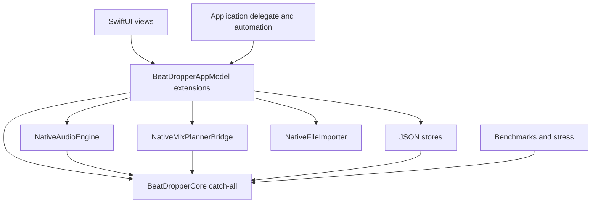
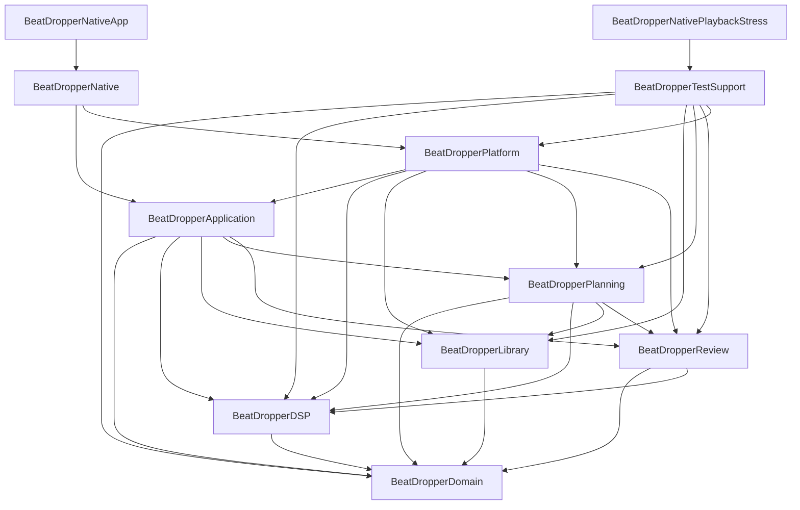

# BeatDropper Modular Architecture Migration

Updated: 2026-08-22

## Objective

Migrate BeatDropper incrementally from a file-split native application into an architecture with explicit module boundaries, cohesive feature ownership, replaceable infrastructure, and one authoritative playback session state. Every slice preserves the native UI, DSP output, beat-aware transitions, planner fallback, persistent data, legacy migration, macOS behavior, and release tooling.

## Baseline

The migration started from commit `34eed15` on `agent/native-dj-redesign` with a clean worktree.

- `swift build --package-path native`: pass
- `swift test --package-path native`: 151 tests in 26 suites passed
- `npm test`: 22 tests in 5 files passed
- Product source: 23,493 Swift lines
- `BeatDropperAppModel` plus extensions: 3,058 lines
- SwiftUI read or invoked 115 distinct app-model members
- Existing Swift package boundary: `BeatDropperNative -> BeatDropperCore`

## Baseline dependency graph



File extensions separated text but did not enforce ownership. Views, selection, the audio engine, and plan state exposed overlapping playback representations.

## Enforced target dependency graph

`BeatDropperApplication` is an intentional use-case layer. `BeatDropperNativeApp` is a minimal executable entry point; `BeatDropperNative` is the reusable native composition/UI module.



The graph is checked from `swift package describe --type json` by `scripts/check-native-module-graph.cjs`. It rejects unexpected edges, cycles, and benchmark/stress source files in production targets. There is no `BeatDropperCore` target or compatibility export.

## Target responsibilities

### BeatDropperDomain

Stable value contracts only: tracks, settings values, analysis results, mix plans, audio meters, and `PlaybackSessionState` plus its reducer events. It has no UI, persistence, process, or AVFoundation dependency.

### BeatDropperDSP

Deterministic DSP and timing math. `NativeDSPAnalyzer` is a thin facade over explicit PCM preparation, waveform/spectral, loudness/stereo, transient/tempo, beat/phrase, cue, and quality/warning stages. Existing numerical algorithms remain in an internal kernel to preserve output.

### BeatDropperLibrary

Library state models, reconciliation, migration, relink assessment, browser indexing, analysis-queue policy, and preparation metadata. Concrete settings, analysis-cache, and library JSON stores are in Platform.

### BeatDropperPlanning

Planner request/response contracts, evidence, validation, scheduling policy, deterministic fallback plans, transition timing, and acceptance. Node/Process execution is in Platform.

### BeatDropperReview

Review state contracts, artifact parsing/filtering, diagnostics, comparison, and export. Concrete JSON persistence is in Platform.

### BeatDropperApplication

Feature state, presentation policy, and side-effect contracts. It owns `PlayingFeature`, `LibraryFeature`, `CreativeFeature`, `MixPlanningFeature`, `MixReviewFeature`, `AppNavigation`, and `AppShellFeature`.

### BeatDropperPlatform

AVFoundation graph/decks/DSP application/metering/recovery, AppKit importing, filesystem stores, clocks/scheduling, and Node/Process planner execution.

### BeatDropperTestSupport

Fixtures, corpus/benchmark builders, large-library stress, planner stress helpers, and the reusable real-audio playback stress driver. Production targets do not depend on it.

### BeatDropperNative

Composition, focused feature controllers, SwiftUI feature views, macOS commands/windows/settings, and the normal application delegate. `BeatDropperAppModel` is a 153-line composition/observation root; it contains no feature use cases or compatibility forwarding state.

### BeatDropperNativeApp

Three-line executable entry point invoking the reusable native application module.

## Authoritative state ownership

| State | Owner | Consumers |
| --- | --- | --- |
| Idle prepared current/next tracks, live current/incoming tracks, both playheads, mode, active plan, transition progress, meters, recovery | `PlayingFeature` via one `PlaybackSessionState` stream | Playing monitor, transport, mix scheduling |
| Playlist order, selections, library records, folders, saved sets, analysis queue/results, browser/search | `LibraryFeature` | Library and Creative UI; planning snapshots |
| Preparation track, preview position, BPM tap estimate/history | `CreativeFeature` | Creative UI and planner request construction |
| Accepted plan, pair/review, planner request identity, schedule/cancellation state | `MixPlanningFeature` | Playing presentation and transition coordination |
| Review events, imported artifacts, filters and comparison selection | `MixReviewFeature` | Review/inspector UI |
| Workspace and panel visibility | `AppNavigation` | App shell |
| Settings value and user notice | `AppShellFeature` | Settings and shared transport/shell |

`PlayingFeature` owns the session subscription and publishes the sole playback state. `PlayingFeatureController` owns transport and transition commands. The root coordinator has no concrete audio-engine property. Views never inspect `NativeAudioEngine`, and playback presentation has no selected-track/engine/plan fallback chain.

Cross-feature mutation is mediated by focused controllers and explicit callbacks/events:

- `LibraryFeatureController`: import, reconciliation, selection, saved sets, analysis queue and persistence
- `CreativeFeatureController`: preview, BPM preparation and hot cues
- `PlayingFeatureController`: transport, manual Next and transition execution
- `MixPlanningFeatureController`: AI/fallback requests, acceptance, schedule/cancel and review events
- `MixReviewFeatureController`: review recording, filtering, comparison, import/export and persistence
- `SettingsFeatureController`: restore, sanitization, persistence and explicit planning invalidation

## Protocol boundaries

- `AudioPlayback`: session stream, preparation, playback and transition commands
- `MixPlanning`: validated planner request/result
- `LibraryRepository`: versioned library load/save and legacy migration entry
- `SettingsRepository`: settings load/save and legacy migration entry
- `TrackAnalysisRepository`: cached analysis load/save
- `TrackAnalyzing`: native analysis execution and file-revision lookup
- `MixReviewRepository`: review artifact load/save
- `FileAvailabilityChecking`, `TrackAvailabilityChecking`, and `TrackImporting`: availability, fingerprints, panels, classification, file and folder import
- `AppClock`, `AppScheduling`, and `AppSchedule`: deterministic time/scheduling seams

Concrete conformances are composed in `BeatDropperNative/ApplicationInfrastructure.swift`. Pure policies remain direct APIs.

## Files and responsibilities moved

- Domain contracts moved from Core to `BeatDropperDomain`.
- Analysis/playback math moved to `BeatDropperDSP`; analyzer orchestration moved to `NativeDSPAnalysisPipeline.swift`.
- Library models/reconciliation/migration/indexing moved to `BeatDropperLibrary`.
- Planner contracts/policies/fallback/acceptance moved to `BeatDropperPlanning`.
- Review models/filtering/diagnostics/export moved to `BeatDropperReview`.
- `NativeAudioEngine`, deck state, meter bridge, importer, analyzer adapter, planner bridge, time adapters, and all JSON stores moved to `BeatDropperPlatform`.
- Feature state, feature presentation, imported-track contracts, settings policy, and dependency protocols moved to `BeatDropperApplication`.
- Root feature use cases moved into `LibraryFeatureController`, `CreativeFeatureController`, `PlayingFeatureController`, `MixPlanningFeatureController`, `MixReviewFeatureController`, and `SettingsFeatureController`; SwiftUI now uses only those six action interfaces and feature state.
- AVFoundation graph lifetime, deck scheduling, crossfade timing, DSP application, meter publication, position timing, and configuration recovery moved behind focused Platform components while `NativeAudioEngine` remains the `AudioPlayback` facade.
- Benchmarks and stress builders moved to `BeatDropperTestSupport`.
- Import/session/real-folder orchestration moved from the 1,536-line production app/delegate file to `BeatDropperNativeTests/BeatDropperNativeAutomationTests.swift`; real AVFoundation playback stress runs through the dedicated `BeatDropperNativePlaybackStress` executable; the production app/delegate file is 289 lines.
- The executable entry moved to `BeatDropperNativeApp/main.swift`.
- Node runner/report primitives moved to `scripts/lib/native-tooling.cjs`; external app-liveness smoke lives in `scripts/lib/macos-launch-smoke.cjs`.
- Accessibility and macOS shell checks use `native/Contracts/native-ui-contract.json` plus packaged metadata instead of Swift source layout regex.
- The compatibility Core target and `BeatDropperCoreTests` name were removed; direct module tests live in `BeatDropperModuleTests`.

## Compatibility decisions

- Codable field names and schema versions remain unchanged and older optional fields remain readable.
- Library/settings/review primary and backup filenames remain unchanged.
- Legacy desktop library, playlist, and settings migration remains active.
- Planner JSON remains backward compatible; no response/request field was removed.
- AI and deterministic fallback plans use the same transition state machine.
- Manual Next retains beat/bar alignment and the existing seconds fallback for weak grids.
- DSP coefficients, thresholds, cue logic, realtime callback behavior, and output were not retuned.
- Meter transport changed from synchronous `NotificationCenter` delivery to lock-free scalar snapshots sampled by the main-actor position publisher. The render tap now measures directly without an intermediate sample allocation. This removes a crossfade-completion lock inversion without changing meter math or audio DSP.
- UI layout, native window/commands/settings, labels, keyboard shortcuts, and accessibility contract were not redesigned.
- Node remains only for planner/calibration/package/release tooling. No Electron package, target, source, or runtime exists.
- Production app launch smoke is external liveness observation; the shipped app no longer interprets smoke/stress environment flags.

## Verification policy

Every structural slice runs the smallest relevant build/tests. Completion verification is:

```sh
swift build --package-path native
swift test --package-path native
npm test
npm run native:benchmark:analysis:gate
npm run native:benchmark:planner
npm run native:stress:playback
npm run native:stress:session
npm run native:accessibility:check
npm run native:macos-shell:check
npm run native:preflight:local
git diff --check
```

## Final verification results

Executed on 2026-08-22 after the integrated migration:

- `swift build --package-path native`: PASS
- `swift test --package-path native`: PASS, 169 tests in 29 suites
- `npm test`: PASS, 24 tests in 6 files
- `npm run native:benchmark:analysis:gate`: PASS with all four expected fixture grades matching
- `npm run native:benchmark:planner`: PASS, 6/6 scenarios
- `npm run native:stress:playback`: PASS; also passed five consecutive race-reproduction runs
- `npm run native:stress:session`: PASS
- `npm run native:accessibility:check`: PASS, 18 contract checks
- `npm run native:macos-shell:check`: PASS, 20 contract checks
- `npm run native:preflight:local`: PASS, 17/17 steps including package, smoke, open-import, playback, normal/extended session, large-library, readiness, and parity
- `git diff --check`: PASS
- Module graph contract: PASS
- Electron dependency check: empty

## Remaining architectural debt

These are internal follow-up items, not external release blockers:

- The DSP pipeline has explicit cohesive stages and a thin public facade, but its deterministic low-level numerical kernel remains a large file. Split it by algorithm family only when fixture and benchmark parity can protect each mechanical move; do not introduce protocol indirection into pure math.
- `NativeLibraryMigration` intentionally remains in Library and performs legacy file decoding directly. A later slice can split decoding IO from pure migration mapping while preserving paths and schemas.
- Some specialized notarization/release scripts retain workflow-specific reporting code. Consolidate further only where doing so does not destabilize signed-artifact verification.

## External release blockers

The codebase and local ad-hoc preflight do not require these. A public notarized release still requires:

- Developer ID Application signing identity and `SIGN_IDENTITY`
- Valid Apple notary credentials
- Notarization/stapling and Gatekeeper acceptance
- A strict release verification report generated from the final signed artifacts
